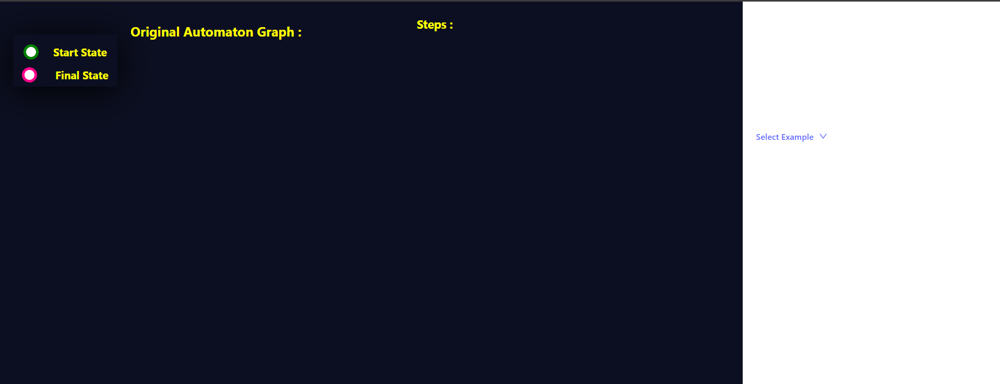
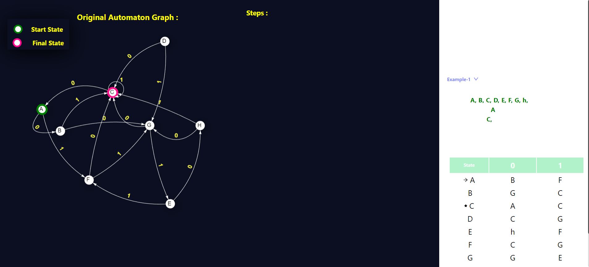
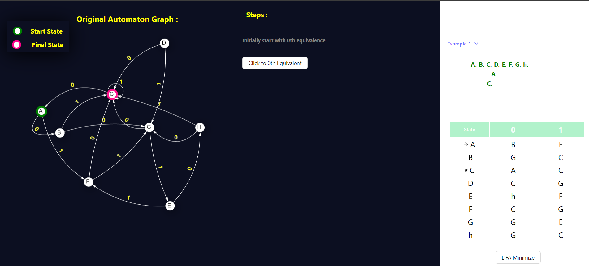
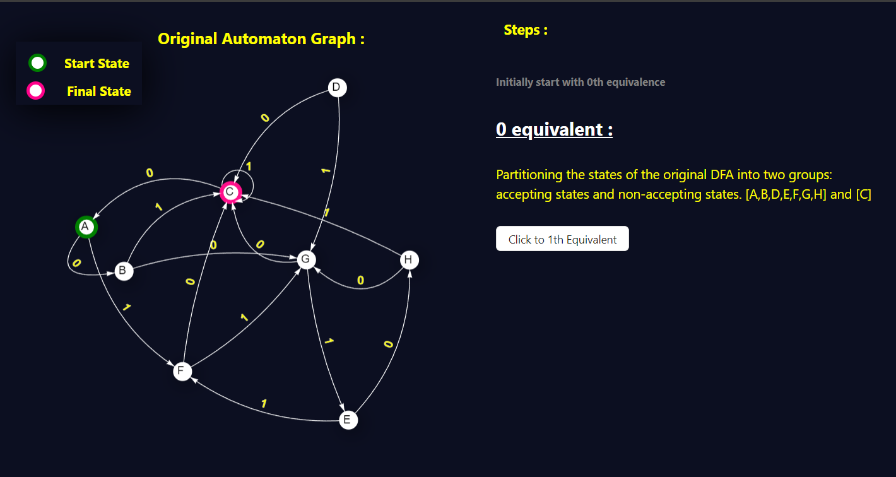
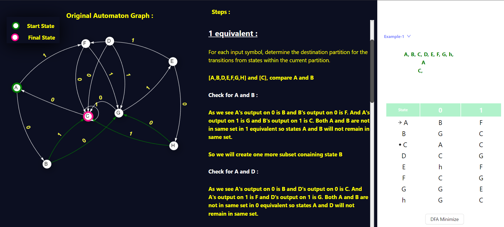
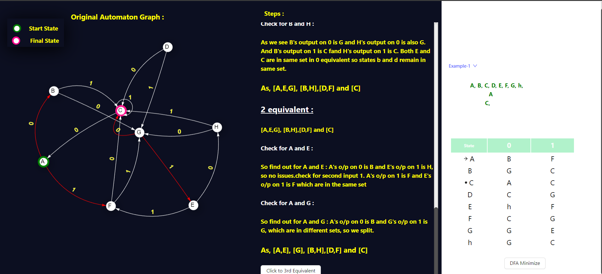
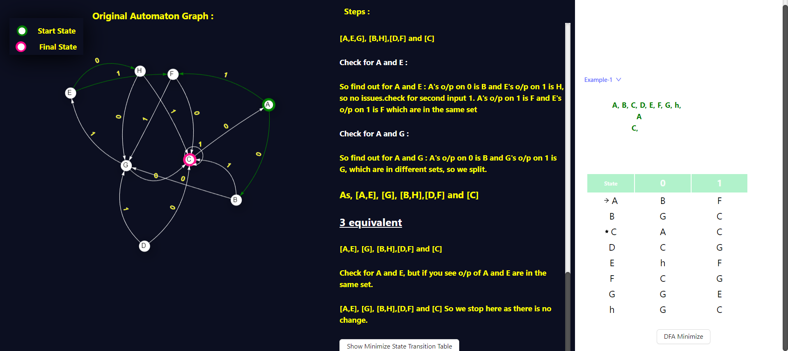
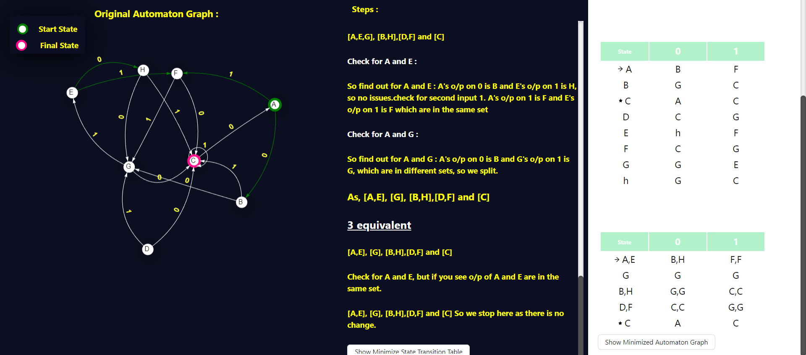
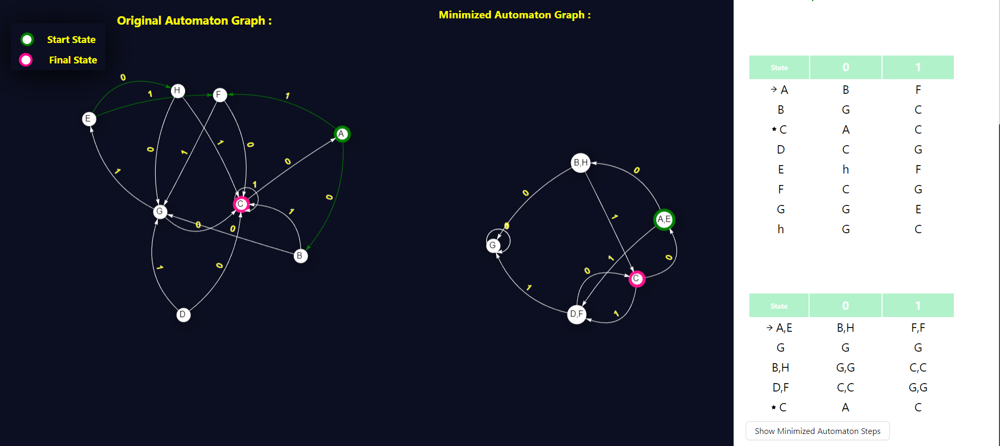

<u><h3>Procedure</u></h3>

Choose the dfa minimization button and follow the instructions 

click the dfa button and select example1 to proceed.

observe the graph and corresponding table generated carefully.

click on the dfa minimization button

click on the 0th equivalence and follow the instructions button

click on the 1st equivalence button and carefully follow the description given and  Iteratively check for equivalence based on input

check for 2nd equivalence and Iteratively check for equivalence based on input

Iteratively check for equivalence based on input,Consider all possible input symbols

Keep iterating through all unmarked pairs and check for equivalence based on input,

minimized table has been created successfully, click on the "show minimized graph " button 

