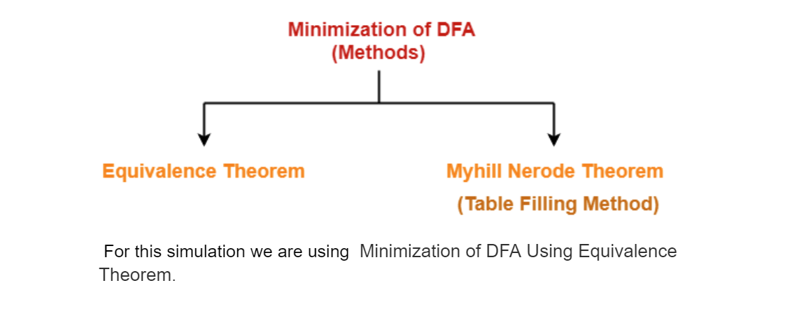

<u><h3>Theory</h3></u>

DFA minimization is the task of transforming a given deterministic finite automaton (DFA) into an equivalent DFA that has a minimum number of states. Here, two DFAs are called equivalent if they recognize the same regular language.

The two popular methods for minimising a DFA are-

<h5>Minimization of DFA Using Equivalence Theorem:</h5>

The Equivalence Theorem provides a method for minimizing a Deterministic Finite Automaton (DFA) by identifying and merging equivalent states. 

Create a table of all possible state pairs:

<li>Construct a table where rows and columns represent all states in the original DFA.</li>
 

 <b>Identify initially distinguishable states:</b>

<li>Start by partitioning the states of the original DFA into two groups: accepting states and non-accepting states.</li>
<li>This initial partition separates states based on their acceptance behaviour.
</li>

<b>Equivalence Class Identification:</b>

<li>Iterate through the partitions and identify equivalence classes by analysing transitions from states within each partition.</li>
<li>For each input symbol, determine the destination partition for the transitions from states within the current partition.</li>
<li>States that lead to the same partition for a given input symbol are considered part of the same equivalence class for that input symbol.</li>

<b>Merge Equivalent States:</b>

<li>If all states within an equivalence class are equivalent for all input symbols, merge them into a single state.</li>
<li>This merging process reduces the number of states in the DFA while preserving language recognition.</li>

<b>Repeat Equivalence Class Identification:</b>

<li>Continue the process of identifying equivalence classes until no further identifications can be made.</li>
<li>At this point, all states within a partition are part of the same equivalence class for all input symbols.</li>
<p?><b>Construct Minimised DFA:</b>

<li>Use the merged states to construct the minimised DFA.</li>
<li>Each merged group of states, representing an equivalence class, becomes a single state in the minimised DFA.</li>

