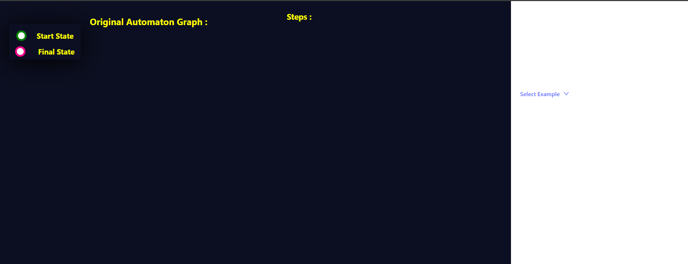
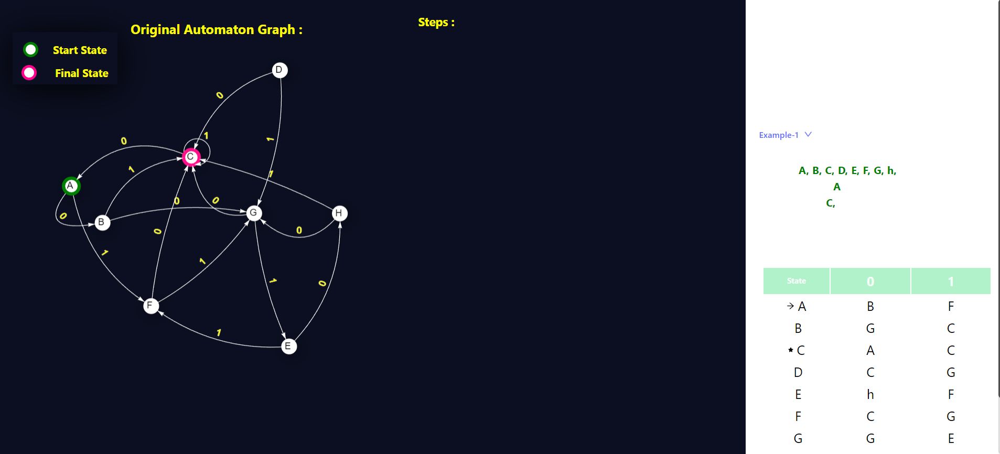
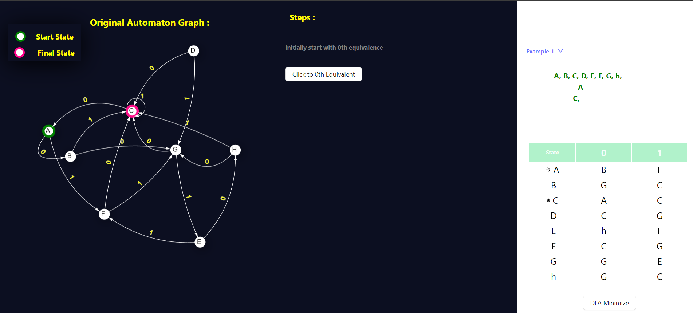
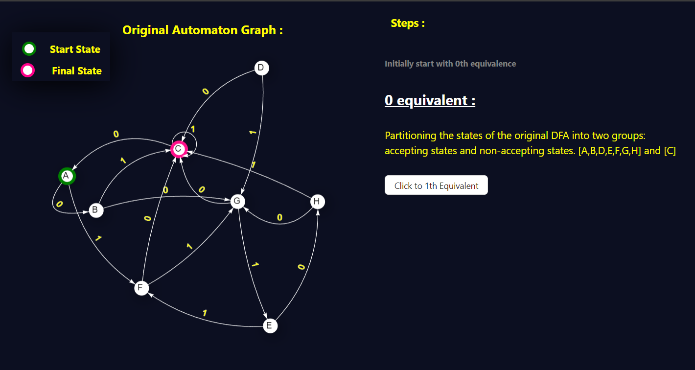
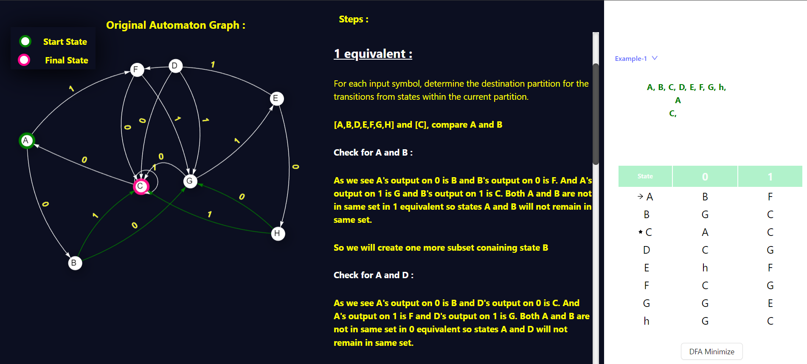
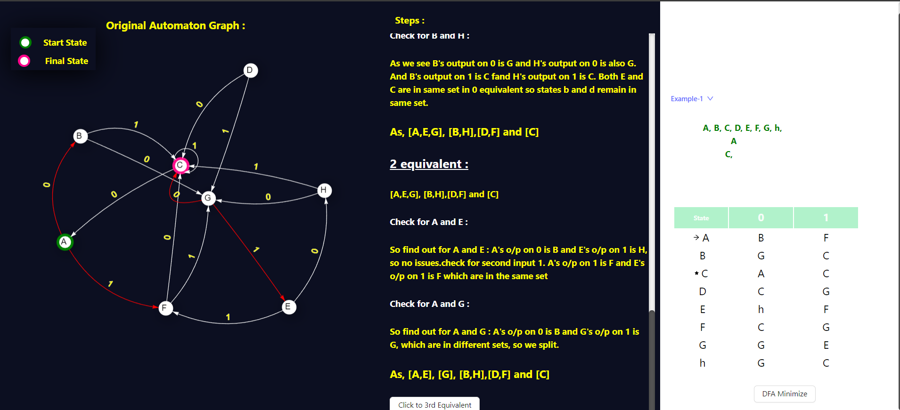
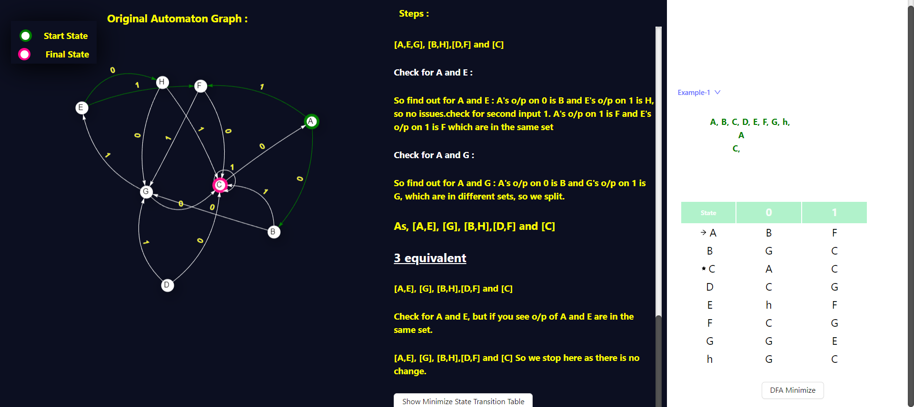
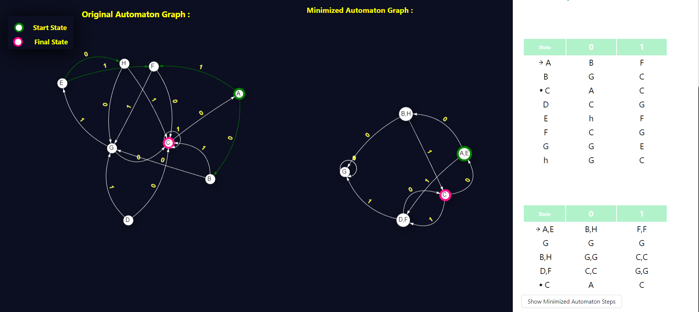

<h3>Procedure</h3>

Start by selecting the "DFA Minimization" option and carefully follow the provided instructions.

Next, click on the "DFA" button and choose "Example 1" to proceed.

Observe the generated graph and its corresponding transition table attentively.

Proceed by clicking on the "DFA Minimization" button.

Select the "0th Equivalence" option and follow the on-screen instructions.

Then, click on the "1st Equivalence" button. Carefully review the provided descriptions and iteratively assess state equivalences based on input symbols.

Continue by checking the "2nd Equivalence" and iteratively evaluate state equivalences for each input symbol.

Persist in examining all unmarked state pairs, ensuring a thorough equivalence check based on input symbols. Consider all possible input scenarios during this process.

Upon completing the iterations, a minimized transition table will be generated. Click on the "Show Minimized Graph" button to visualize the optimized DFA.

